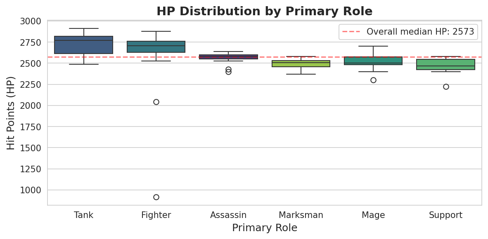
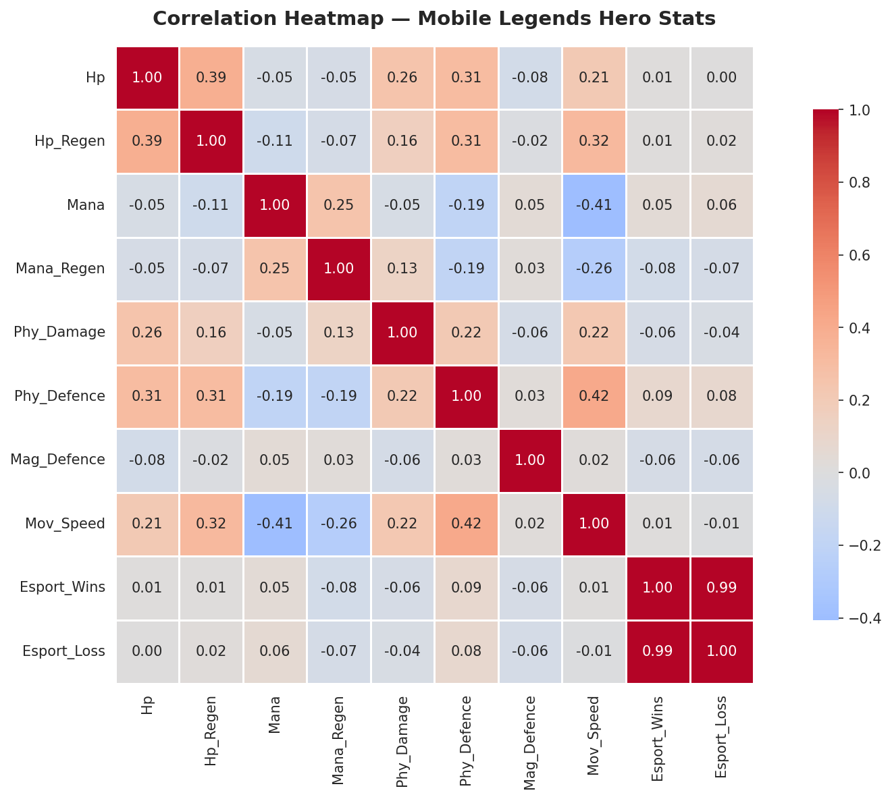
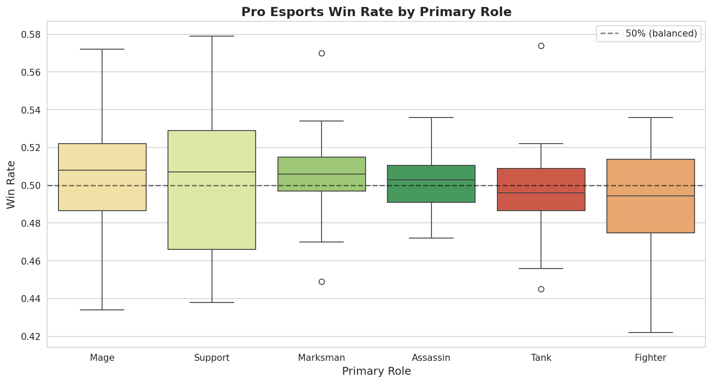

# Mobile Legends: Bang Bang - Hero Data Analysis

Exploratory data analysis of 114 heroes from Mobile Legends: Bang Bang, examining role distribution, combat statistics, competitive esports performance, and statistical relationships between hero attributes.

## Project Overview

Mobile Legends: Bang Bang (MLBB) is one of the most popular MOBA games worldwide, with a competitive esports scene drawing millions of viewers. This project analyzes the game's hero roster to uncover patterns in hero design, role balance, and competitive performance.

**Dataset:** 114 heroes, 18 attributes (combat stats, roles, esports win/loss records)
**Source:** [Kaggle - Mobile Legends Bang Bang Dataset](https://www.kaggle.com/datasets/kishan9044/mobile-legends-bang-bang)

## Objectives

1. Understand the distribution of heroes across primary roles
2. Compare combat statistics between different roles
3. Identify correlations and trade-offs in hero design
4. Engineer features to measure true competitive performance
5. Determine which heroes and roles dominate in pro esports

## Tech Stack

- **Python 3**
- **pandas** - data manipulation, cleaning, and feature engineering
- **NumPy** - numerical operations
- **matplotlib & seaborn** - data visualization
- **Google Colab** - development environment
- **Kaggle API** - programmatic dataset retrieval

## Key Findings

### Hero Distribution by Role


- **Fighters dominate** the roster with 33 heroes (29% of total)
- **Mages** are second-most common (25 heroes)
- **Support** is the rarest role with only 9 heroes (8%), suggesting they're highly specialized
- 76% of heroes are offensive roles (Fighter + Mage + Marksman + Assassin)

### HP Distribution by Role


- **Tanks and Fighters** sit clearly above the overall median HP (2,573)
- Surprisingly, **Mages have higher avg HP than Marksmen** - challenging the assumption that mages are the squishiest
- **Notable outlier:** X.Borg appears as a Fighter with just 918 HP - far below role norms. Investigation revealed his low base HP is intentional design (his Flame Armor mechanic acts as a second health bar). This reflects domain mechanics, not data error.

### Correlation Heatmap - Hero Stat Relationships


**Key correlations discovered:**
- **Mana ↔ Movement Speed (-0.41):** Clear mana-vs-mobility trade-off. Mana-using spell casters trade movement speed for spell power.
- **Physical Defence to Movement Speed (+0.42):** Tanky heroes maintain decent mobility - role clustering effect.
- **HP to Physical Defence (+0.31):** Durable heroes get the full survivability package.
- **Magic Defence:** The only stat with near-zero correlation to all others (all |r| < 0.10), suggesting it functions as an independent balancing lever.

**Critical data quality finding:**
- `Esport_Wins` and `Esport_Loss` correlated at **0.99**, indicating both reflected pick frequency, not competitive performance. This motivated feature engineering for a normalized **Win Rate** metric.

### True Competitive Performance - Win Rate by Role


After engineering `Win_Rate = Esport_Wins / Total_Matches` and filtering to heroes with ≥100 matches (statistical significance):

- **Exceptional class balance:** Median win rates across all 6 roles cluster within just **1.4 percentage points** (49.4% - 50.8%)
- **Mages and Supports** show the widest variance - hero choice within these roles is critical
- **Marksmen and Assassins** show tight clustering - more consistent within-role performance
- **Top 3 individual performers (≥100 matches):** Faramis (Support, 57.9%), Franco (Tank, 57.4%), Kadita (Mage, 57.2%)
- **Bottom 3 performers:** Leomord (Fighter, 42.2%), Cyclops (Mage, 43.4%), Chang'e (Mage, 43.7%)

## Data Quality Notes

- **84 of 114 heroes had no Secondary_Role** - not a data error, but a meaningful design pattern (most heroes are single-role specialists). Filled with "None".
- **One hero (Yin) had missing Mana_Regen** - domain knowledge revealed Yin uses an alternative energy system (Lieh Energy) and doesn't consume mana. Filled with 0 to accurately reflect game mechanics.
- **Mag_Damage column was a "dead column"** - all 114 heroes had a value of 0.0, indicating the dataset only tracks base stats (magic damage scales from items in-game). Dropped during analysis.

## Repository Structure

```
mobile-legends-data-analysis/
├── 01_mobile_legends_eda.ipynb     # Main analysis notebook
├── hero_role_distribution.png      # Visualization 1: role distribution
├── hp_distribution_by_role.png     # Visualization 2: HP boxplot
├── correlation_heatmap.png         # Visualization 3: stat correlations
├── winrate_by_role.png             # Visualization 4: pro win rates
├── README.md                       # This file
└── .gitignore                      # Files excluded from version control
```

## Project Status

**Active development** — ongoing analytical exploration.

### Completed:
- [x] Data loading via Kaggle API
- [x] Data cleaning with domain-informed imputation
- [x] Hero distribution analysis
- [x] Combat stats comparison by role
- [x] Outlier investigation and validation
- [x] Multivariate correlation analysis
- [x] Feature engineering (Win Rate, Total Matches)
- [x] Statistical significance filtering
- [x] Pro esports performance analysis

### Next steps:
- [ ] Identify "S-tier" outlier heroes using statistical thresholds
- [ ] Lane-based performance analysis
- [ ] Predictive modeling for win rate
- [ ] Interactive dashboard with Plotly or Streamlit

## Author

**Biju Willsmith** — MSc Data Science student passionate about gaming analytics and data-driven insights.

- GitHub: [@biju-ds](https://github.com/biju-ds)
