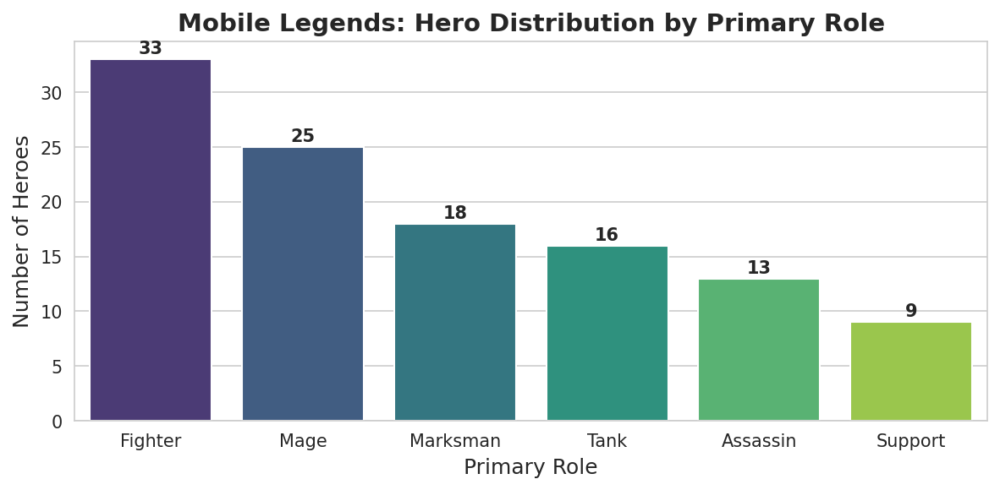

# Mobile Legends: Bang Bang - Hero Data Analysis
Exploratory data analysis of 114 heroes from Mobile Legends: Bang Bang, examining role distribution, combat statistics, and competitive esports performance.

## Project Overview
Mobile Legends: Bang Bang (MLBB) is one of the most popular MOBA games worldwide, with a competitive esports scene drawing millions of viewers. This project analyzes the game's hero roster to uncover patterns in hero design and competitive performance.

**Dataset:** 114 heroes, 18 attributes (combat stats, roles, esports win/loss records)
**Source:** [Kaggle - Mobile Legends Bang Bang Dataset](https://www.kaggle.com/datasets/kishan9044/mobile-legends-bang-bang)

## Objectives
1. Understand the distribution of heroes across primary roles
2. Identify patterns in combat statistics across different roles
3. Analyze esports performance to find which roles dominate competitive play
4. Investigate relationships between hero attributes like; HP, damage, defense, etc.

## Tech Stack
- **Python 3**
- **pandas** - used it for data manipulation and cleaning
- **NumPy** - for numerical operations
- **matplotlib & seaborn** - for data visualization
- **Google Colab** - environment

## Key Findings

### Hero Distribution by Role


- **Fighters dominate** the roster with 33 heroes (29% of all heroes)
- **Mages** are the second most common at 25 heroes
- **Marksmen & Tanks** have 18 and 16 respectively
- **Support** is the rarest role with only 9 heroes - suggesting they're highly specialized
- The roster shows a clear preference for offensive roles (Fighter + Mage + Marksman + Assassin = 76% of heroes)

### Data Quality Notes
- 84 of 114 heroes have no secondary role - most heroes are specialized in single-role, which is meaningful and not a data error
- One hero (Yin) had a missing Mana_Regen value - investigation revealed Yin doesn't consume mana, so this was filled with 0 to accurately reflect game mechanics

## Repository Structure

```
mobile-legends-data-analysis/
├── 01_mobile_legends_eda.ipynb    # Main analysis notebook
├── hero_role_distribution.png     # Visualization output
├── README.md                      # This file
└── .gitignore                     # Files excluded from version control
```

## Project Status

**In progress** - this is Day 1 of an ongoing analysis. Next steps:
- [ ] Statistical comparison of combat stats across roles
- [ ] Correlation analysis between attributes
- [ ] Esports win-rate analysis by role
- [ ] Identify statistical outlier heroes ("S-tier" candidates)
- [ ] Interactive dashboard

## Author

**Biju Willsmith** - MSc Data Science student passionate about gaming analytics and data-driven insights.

- GitHub: [@biju-ds](https://github.com/biju-ds)
